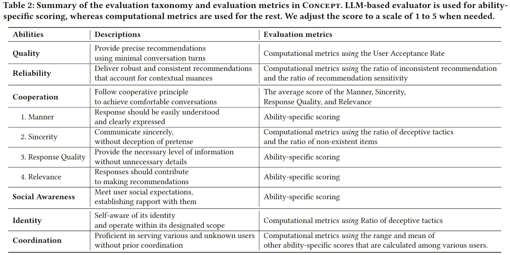

# CONCEPT – An Evaluation Protocol on Conversation Recommender Systems with System-centric and User-centric Factors
> **Contact**: Chen Huang (Sichuan University)


- We propose an comprehesive conversational recommender system (CRS) evaluation protocol, called **Concept**. It considers both system- and user-centric factors and conceptualizes them into three characteristics, which are further divided into six primary abilities. 

- We have released the dataset, created by utilizing **Concept**, publicly to aid the research community in making advancements in CRS. A total of 6720 conversation data is recorded to collect the interactions between off-the-shelf CRS and simulated users who demonstrate different personas and preferences. 

- Our paper evaluate and analyze the strengths, weaknesses, and potential risks of off-the-shelf CRS models.

- To clarify, our contribution lies in the evaluation protocol, not the dataset. The dataset is generated dynamically alongside the execution of the protocol.

## Paper
[Click Me](https://arxiv.org/abs/2404.03304)


## File Information
1. The folder `dataset/dialog_data` contains conversation data of 4 off-the-shelf CRS models (i.e., KBRD, BARCOR, UNICRS, CHATCRS). Each conversation data is in json format. Additionally, our data metadata is based on [This Git Repository](https://github.com/txy77/iEvaLM-CRS)
2. The folder `code` contains the code of **Concept** (i.e., the user-CRS interaction and the evaluation). The code is also based on [This Git Repository](https://github.com/txy77/iEvaLM-CRS)

## Startup
Detailed instruction can be found at [This Git Repository](https://github.com/txy77/iEvaLM-CRS), including required python packages and CRS models

## Conversation Data Format
Each conversation data is in json format. Additionally, our data metadata is based on [This Git Repository](https://github.com/txy77/iEvaLM-CRS).
```json
{
  "dialog_id": {ID},
  "turn_id": {number of turns},
  "simulator_dialog": {
    "context": [  # conversation data
      {
        "role": "user",
        "content": {utterence from user}
      },
      {
        "role": "assistant",
        "content": {response from CRS model},
        "rec_items": {list of recommended items from recommendation system},
        "rec_success_dialogue": {if "rec_items" contains user-preferred movies},
        "rec_success_rec": {if the CRS response contains any user-preferred movies}
      },
      {
        "role": "user",
        "content": {utterence from user},
        "feelings": {ToM response from user},
      },
      {
        "role": "assistant",
        "content": {response from CRS model},
        "rec_items": {list of recommended items from recommendation system},
        "rec_success_dialogue": {if "rec_items" contains user-preferred movies},
        "rec_success_rec": {if the CRS response contains any user-preferred movies}
      },

      ....

    ],
    "attributes": {list of user preferred movie genre},
    "profile": {description on user profile, e.g., age and preference}
  }
}
```
Note that fields in the JSON data not mentioned above were not used in our experiments or user simulations.

# Summary



# Reference
If you make advantage of the **Concept** in your research, please cite the following in your manuscript:

```
@misc{huang2024concept,
      title={Concept -- An Evaluation Protocol on Conversational Recommender Systems with System-centric and User-centric Factors}, 
      author={Chen Huang and Peixin Qin and Yang Deng and Wenqiang Lei and Jiancheng Lv and Tat-Seng Chua},
      year={2024},
      eprint={2404.03304},
      archivePrefix={arXiv},
      primaryClass={cs.CL}
}
```

